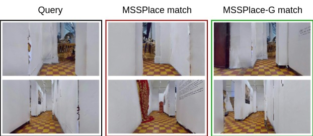
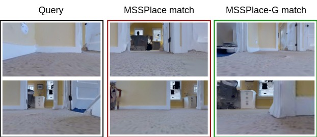

# Place Recognition performance ablation

In this file we visualize the predictions of MSSPlace and MSSPlace-G.

According to the paper, their metrics are:

| Method     | AR@1      | AR@5      |
|------------|-----------|-----------|
| MSSPlace   | 95.21     | 98.69     |
| MSSPlace-G | **95.26** | **99.14** |

The proposed MSSPlace-G approach improves performance in generating
more effective global descriptors for the images.

Below you can see the examples of scenes where MSSPlace fails
and MSSPlace-G succeeds.

